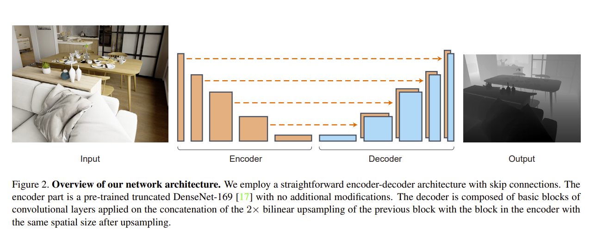
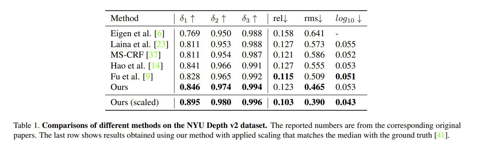

# Model Name         
# DenseDepth  
## 1.Introduction
DenseDepth is form Arxiv: High Quality Monocular Depth Estimation via Transfer Learning,
used for monocular depth estimation.

[High Quality Monocular Depth Estimation via Transfer Learning](https://github.com/ialhashim/DenseDepth.git)   


DenseDepth mainly extracts image features through Densenet169 encoder and bilinear interpolation up-sampling 
decoder which restores image depth. 
The main idea is to use the backbone trained on ImageNet, 
carrying out transfer learning.
In addition, the training direction is constrained by SSIM luminosity error, 
image gradient smoothing error and depth estimation error during training. 


On NYU depth dataset densedepth achieves SOTA at monocular depth estimation.
## 2.Reproduce performance
| | a1 | a2 | a3 | rel | rms | log10  
:-----:|:-----:|:-----:|:----------:|:----:|:-----:|:--------:|
origin repo | 0.895 | 0.980 | 0.996 | 0.103 | 0.390 | 0.043 |
paddle reproduce| 0.896 | 0.981 | 0.995 | 0.106 | 0.456 | 0.044 |

## 3.NYU Depth Dataset
nyu depth dataset is used to train. Link is as below:
[nyu_depth](https://drive.google.com/drive/folders/1TzwfNA5JRFTPO-kHMU___kILmOEodoBo?usp=sharing)

The dataset is nearly 4.1G，which contains 50k training RGB images
and 1308 testing RGB images with their depth groundtruths. 

## 4.Environments required
The software dependencies are as below：   
```
paddlepaddle-gpu>=2.0
tensorboardX
```
The hardware:   
training needs GPU RAM>=9GB(batch_size=4)   RAM>=18GB(batch_size=8)

testing can be done on CPU but is very slow.

## 5.Quick start
### using pretrained DenseDepth to test and eval
densenet pretrained model:        
Link: https://pan.baidu.com/s/1KUPnjUgpG40VSDLBHEcRIQ     
code：zid4   
densenet model should be put on model/   

DenseDepth pretrained model:       
Link:https://pan.baidu.com/s/1f1lYptz3xVMs3mJKvVgrUw     
Code:as0z     
DenseDepth model should be put on logs/   

then do predict or eval:      
```
# predict your own image, you should put RGBs on images/
python predict.py

# eval the model. you should put nyu_data.zip on data/
python eval.py

```
### using densenet pretrained model to transfer learning
densenet pretrained model:      
Link:https://pan.baidu.com/s/1KUPnjUgpG40VSDLBHEcRIQ    
Code:zid4   
put densenet on model/   

put nyu_data.zip on data/   

modify configs/main.cfg(recommand to use the default params)，then start training:  
```
python train.py
```

## 6.Code structure and Introduction
### structure
├─configs                          
├─data                         
├─images     
├─logs                          
├─model                          
├─results                         
├─utils                                                
│  eval.py                        
│  predict.py                                           
│  README.md                      
│  README_cn.md                   
│  requirement.txt                
│  train.py                       

### Instructions
configs/main.cfg train,predict,eval are used on training, testing and evaluation separately.   

```
[train] training params 
# 
epochs = 20
# 
learning_rate = 0.0001
# 
batch_size = 8

[eval] evaluation params
# 
weights_path = logs/DenseDepth_val_best.pdparams

[predict]
# 
weights_path = logs/DenseDepth_val_best.pdparams
# 
imagedir_path = images/
# 
color_map = gray
```

### 文件说明
```
configs/main.cfg   # params config
data/data.py   # dataset processing
images/   # images dir for testing
logs/   # model save dir when training
model/densenet   # densenet backbone
model/model.py   # densedepth mdoel
results/   # image dir for testing results
utils/losses.py   # losses definition on training
utils/utils.py    # some utils for visualization and image loading

eval.py  # evaluation main file
predict.py   # testing main file
train.py   # training main file
```